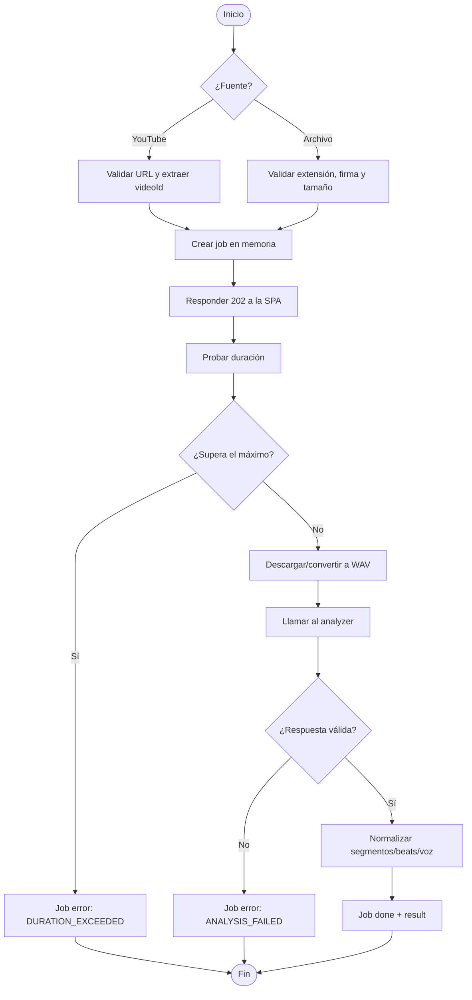
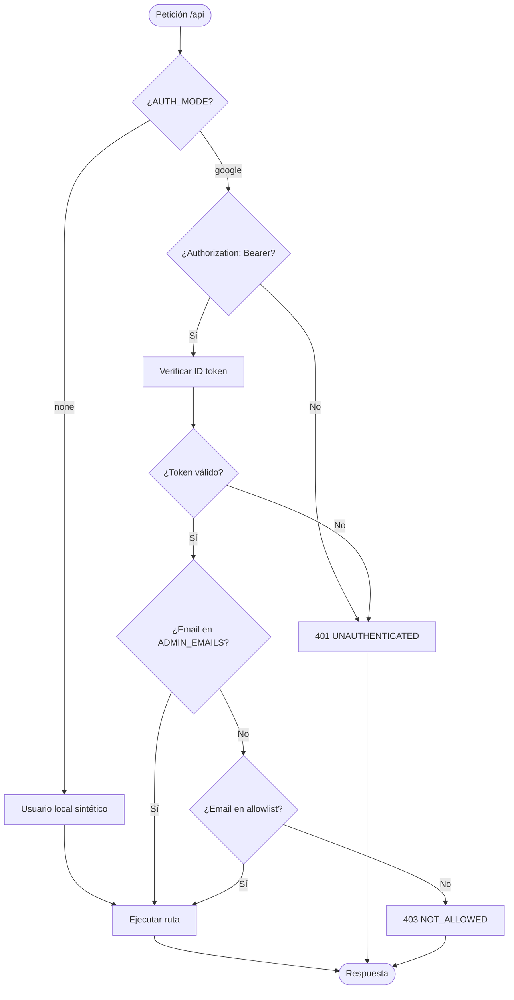
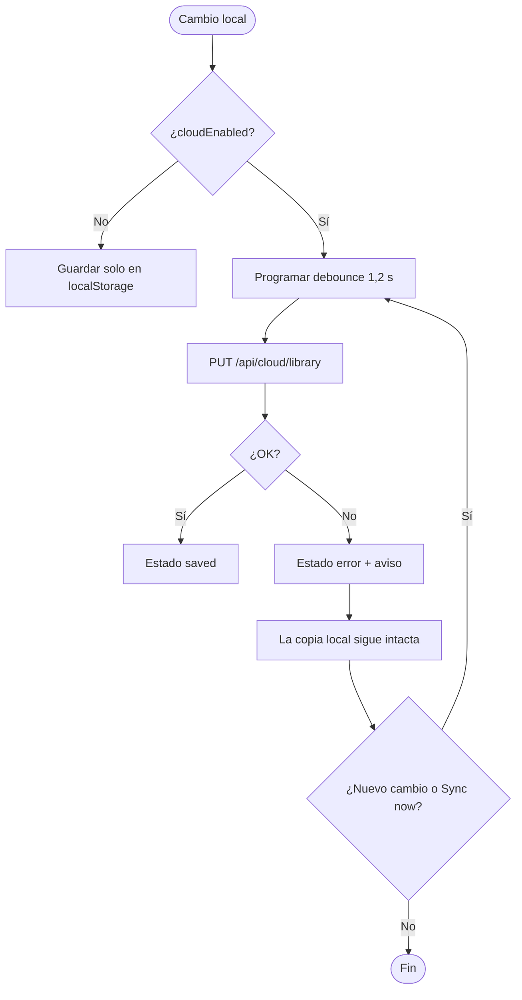

# 10 — Diagramas de actividad

## Análisis de audio

```mermaid
flowchart TD
    A([Inicio]) --> B{¿Fuente?}
    B -->|YouTube| C[Validar URL y extraer videoId]
    B -->|Archivo| D[Validar extensión, firma y tamaño]
    C --> E[Crear job en memoria]
    D --> E
    E --> F[Responder 202 a la SPA]
    F --> G[Probar duración]
    G --> H{¿Supera el máximo?}
    H -->|Sí| I[Job error: DURATION_EXCEEDED]
    H -->|No| J[Descargar/convertir a WAV]
    J --> K[Llamar al analyzer]
    K --> L{¿Respuesta válida?}
    L -->|No| M[Job error: ANALYSIS_FAILED]
    L -->|Sí| N[Normalizar segmentos/beats/voz]
    N --> O[Job done + result]
    I --> P([Fin])
    M --> P
    O --> P
```

## Acceso a la instancia online

```mermaid
flowchart TD
    A([Petición /api]) --> B{¿AUTH_MODE?}
    B -->|none| C[Usuario local sintético]
    C --> Z[Ejecutar ruta]
    B -->|google| D{¿Authorization: Bearer?}
    D -->|No| E[401 UNAUTHENTICATED]
    D -->|Sí| F[Verificar ID token]
    F --> G{¿Token válido?}
    G -->|No| E
    G -->|Sí| H{¿Email en ADMIN_EMAILS?}
    H -->|Sí| Z
    H -->|No| I{¿Email en allowlist?}
    I -->|No| J[403 NOT_ALLOWED]
    I -->|Sí| Z
    Z --> K([Respuesta])
    E --> K
    J --> K
```

## Sincronización local/nube

```mermaid
flowchart TD
    A([Cambio local]) --> B{¿cloudEnabled?}
    B -->|No| C[Guardar solo en localStorage]
    B -->|Sí| D[Programar debounce 1,2 s]
    D --> E[PUT /api/cloud/library]
    E --> F{¿OK?}
    F -->|Sí| G[Estado saved]
    F -->|No| H[Estado error + aviso]
    H --> I[La copia local sigue intacta]
    I --> J{¿Nuevo cambio o Sync now?}
    J -->|Sí| D
    J -->|No| K([Fin])
```
